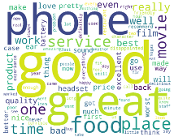

# Sentiment_Analysis_Using_Rule_based

 
 ## Objective:
 
Using VADER (Valence Aware Dictionary and sEntiment Reasoner) which is a lexicon and rule-based sentiment analysis tool that is specifically attuned to sentiments expressed in social media. It is fully open-sourced under the [MIT License]. 

## How do the data look ?  

 ## Model Result:
 

 
